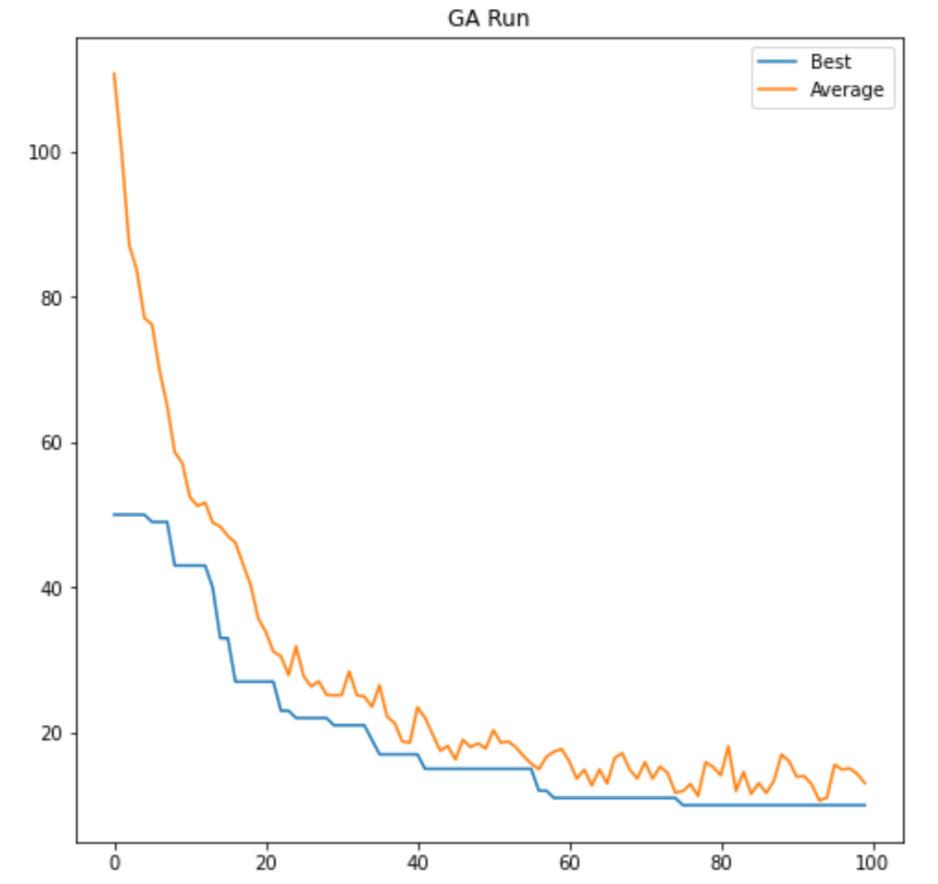
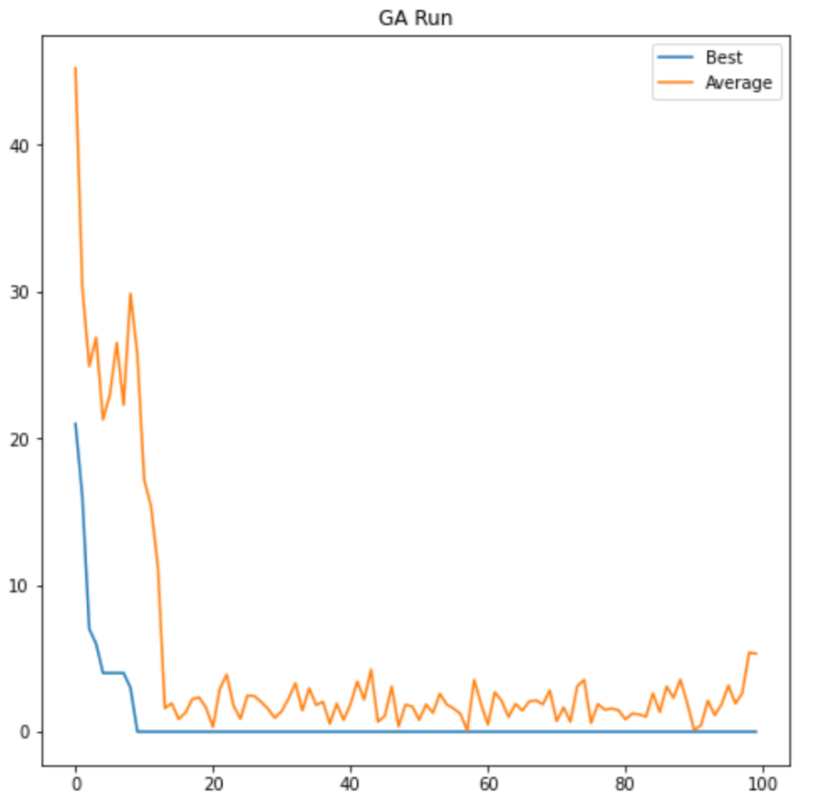

# $5\times5$ Magic Square

A magic square is a game in which the goal is to arrange unique numbers inside a square matrix in a way that the sum of the numbers in all the rows, all the columns and the two main diagonals equals the same number. In the case of a $5\times5$ magic square, the number is 65, and the numbers to arrange go from 1 to 25. In the notebook `magic_square_5x5_A01019685.ipynb` I present a genetic and memetic algorithms for the search of the $5\times5$ magic square.

Genetic algorithms work by defining an initial population, and evaluating it with an evaluation function. Afterwards, individuals are allowed to crossover to produce new individuals, which are evaluated as well. This process is repeated until a solution is found or a stopping condition is met.

A slight variant can be applied to the genetic algorithm to transform it into a Memetic algorithm: local search. The process of slightly mutating a gene is a form of local search, in which you look in similar cases for a better solution. The gene mutation works by swapping the positions of two numbers in the square.

In this case, the evaluation function is the sum of the differences between each row, column and main diagonal to 65. Ideally, the sum of the differences should be 0.

Running experiments it can be seen that simply switching from a purely genetic algorithm (left) to a memetic one (right), the performance increases drastically, as seen in the images below. Using a purely genetic algorithm no solution was found on 100 iterations. However, with the memetic algorithm had a success rate of 91%, defined as the number of generations in which a solution was found.

 
